# 📘 MVC CRUD Application using JSP, Servlet, and JDBC (PostgreSQL)


A clean and modular **MVC web application** built using **JSP, Servlets, JDBC, and PostgreSQL**.  
This project demonstrates a professional backend structure with proper MVC layering, centralized error handling, Bootstrap UI, and complete CRUD operations.

GitHub Repository: **https://github.com/Imsujit/crud_app**

> **Current Stable Release:** `v1.2-auth`

---

## ✨ Features (Current Version – v1.2 Authentication)

- **Core CRUD Operations**
    - Add Student
    - View Student List
    - Edit Student
    - Delete Student

- **Pagination**
    - Page navigation (First / Previous / Next / Last)
    - Page size selection
    - Go-to-page option
    - Record range indicator

- **User Authentication**
    - User Registration
    - User Login / Logout
    - Session-based Authentication
    - Filter-based Route Protection (`UserFilter`)
    - Shared Header Component (`header.jsp`)

- **Validation**
    - Client-side validation using HTML5
    - Server-side validation in Servlet

- **UI / UX Enhancements**
    - Responsive layout using Bootstrap
    - Clean and consistent action buttons
    - User-friendly messages and alerts

- **Centralized Exception Handling**
    - Custom `DAOException`
    - Dedicated error page (`error.jsp`)

- **Clean MVC Separation**
    - Model → Data representation
    - DAO → Database access
    - Controller → Request handling
    - View → UI rendering

---

## 🛠️ Technology Stack

| Layer | Technology |
|------|-----------|
| Frontend (View) | JSP, HTML5, CSS3, Bootstrap 5 |
| UI Icons | Font Awesome |
| Controller | Jakarta Servlet API |
| Backend (Business Logic) | Java |
| Database Access | JDBC |
| Database | PostgreSQL |
| Application Server | Apache Tomcat 11 |
| Build Tool | Maven |
| Architecture Pattern | MVC (Model–View–Controller) |
| Version Control | Git & GitHub |

---

## 📁 Project Structure

```
crud_app/
│
├── src/main/java
│   └── com/nsgacademy/crudapp
│       ├── model                # Domain & request models
│       │   ├── Student.java
│       │   ├── User.java
│       │   └── Pagination.java
│       │
│       ├── dao                  # Data Access Layer (JDBC)
│       │   ├── StudentDAO.java
│       │   ├── StudentDAOImpl.java
│       │   ├── UserDAO.java
│       │   └── UserDAOImpl.java
│       │
│       ├── exception            # Centralized exception handling
│       │   └── DAOException.java
│       │
│       ├── filter               # Servlet Filters
│       │   └── UserFilter.java
│       │
│       ├── utils                # Utility & Infrastructure classes
│       │   └── JDBCUtils.java
│       │
│       └── controller           # Controller layer (Servlets)
│           ├── StudentServlet.java
│           └── UserServlet.java
│
├── src/main/webapp               # View Layer (JSP)
│   ├── student-list.jsp
│   ├── student-form.jsp
│   ├── register.jsp
│   ├── login.jsp
│   ├── header.jsp
│   └── error.jsp
│
├── screenshots                   # Versioned UI screenshots
│   ├── v1.0
│   ├── v1.1
│   └── v1.2
│
├── pom.xml
└── README.md
```

---

## 🧠 Architecture Overview

This application follows the **classic MVC (Model–View–Controller) architecture**.

- **Model**
    - Represents application data (`Student`, `User`)

- **DAO Layer**
    - Contains all SQL queries
    - Handles database interaction only

- **Filter Layer**
    - `UserFilter` intercepts requests and enforces authentication

- **Controller (Servlet)**
    - Routes HTTP requests
    - Performs server-side validation
    - Controls application flow

- **View (JSP)**
    - Responsible only for UI rendering
    - Contains no business logic

**Design Principles**
- No SQL in JSP
- No JDBC code in Servlet
- Clear separation of responsibilities
- Easy to extend and maintain

---

## 🗄️ Database Schema

```sql
CREATE TABLE student (
    id SERIAL PRIMARY KEY,
    name   VARCHAR(50) NOT NULL,
    email  VARCHAR(100) NOT NULL,
    mobile VARCHAR(10) NOT NULL
);

CREATE TABLE users (
    id       SERIAL PRIMARY KEY,
    username VARCHAR(50) NOT NULL UNIQUE,
    email    VARCHAR(100) NOT NULL UNIQUE,
    password VARCHAR(255) NOT NULL
);
```

---

## ⚙️ Configuration

### Database Configuration

Update database credentials in `JDBCUtils.java`:

```java
private static final String URL  = "jdbc:postgresql://localhost:5432/crudapp";
private static final String USER = "postgres";
private static final String PASS = "password";
```

---

## ▶️ How to Run the Project (Detailed)

### 1️⃣ Prerequisites
- JDK 17 or higher
- PostgreSQL installed and running
- Apache Tomcat 11
- IDE (IntelliJ IDEA / Eclipse)

---

### 2️⃣ Clone the Repository
```bash
git clone https://github.com/Imsujit/crud_app.git
```

---

### 3️⃣ Create Database
```sql
CREATE DATABASE crudapp;
```

Create tables using the schema provided above.

---

### 4️⃣ Import Project into IDE
- Open IDE
- Import as **Maven Project**
- Configure Apache Tomcat 11 in IDE

---

### 5️⃣ Run Application
- Deploy project on Tomcat
- Access application at:

```
http://localhost:8080/<context-root>/login
```

---

## 🏷️ Versioning Strategy (Planned Roadmap)

This project follows **incremental, tagged releases** to ensure stability.

| Version              | Features |
|----------------------|--------|
| v1.0-crud            | Core CRUD |
| v1.1.1-pagination    | Pagination |
| v1.2-auth            | User Authentication (current stable) |
| v1.3-search          | Search |
| v1.4-sorting         | Sorting |
| v1.5-advanced-fields | Gender, DOB, Age Calculation |
| v1.6-file-upload     | Student Photo Upload |
| v1.7-import          | Import (CSV / Excel) |
| v1.8-export          | Export (CSV, Excel, PDF, HTML) |
| v1.9-audit           | Audit Logs |
| v2.0-deployment      | Deployment Configuration |
| v3.0-hibernate       | Hibernate Migration |
| v4.0-jpa             | JPA Migration |

Each version will be **independently stable and tagged**.

---

## 🔮 Future Architecture Direction

This project is intentionally designed to align with modern Spring-based applications.

Planned transitions:
- Servlet MVC → Spring MVC
- JDBC → Spring Data JPA
- JSP → REST APIs + Frontend (React / Thymeleaf)
- Manual pagination → `Pageable`
- Manual filters → Specification / Criteria-based filtering
- Session Auth → Spring Security

---

## ⚠️ Known Limitations (Intentional)

- No Service layer (kept simple for Servlet MVC)
- No ORM in early versions (JDBC used for clarity)
- No REST APIs yet
- Passwords stored as plain text in early versions (encryption planned)

---

## 📸 Screenshots

### v1.0 – Core CRUD Functionality

| Feature                 | Screenshot                                                     |
|-------------------------|----------------------------------------------------------------|
| Student List            | 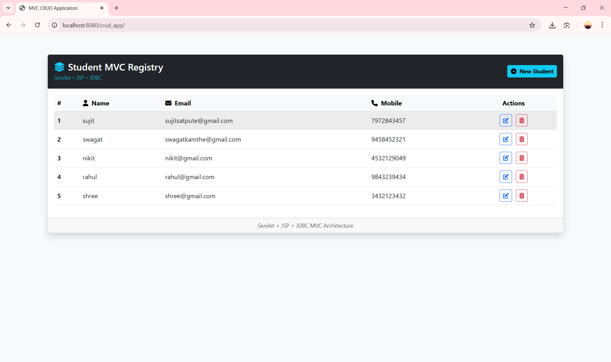                     |
| Delete Confirmation     | 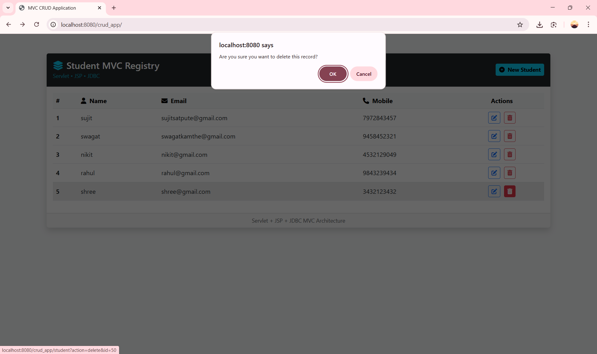            |
| Delete Success Message  | 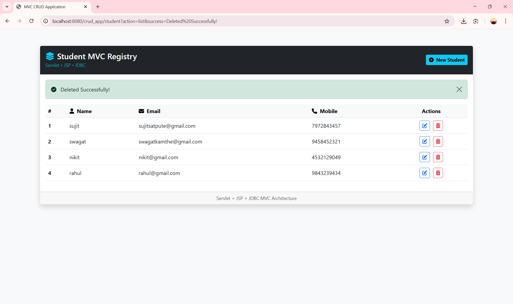                |
| Add Student             | 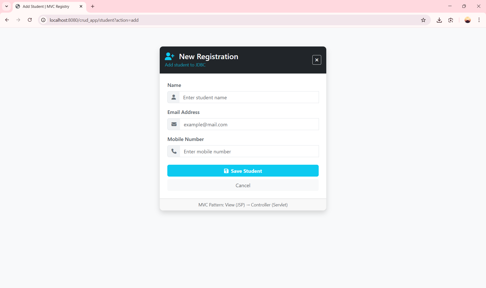                          |
| Add Success Message     | 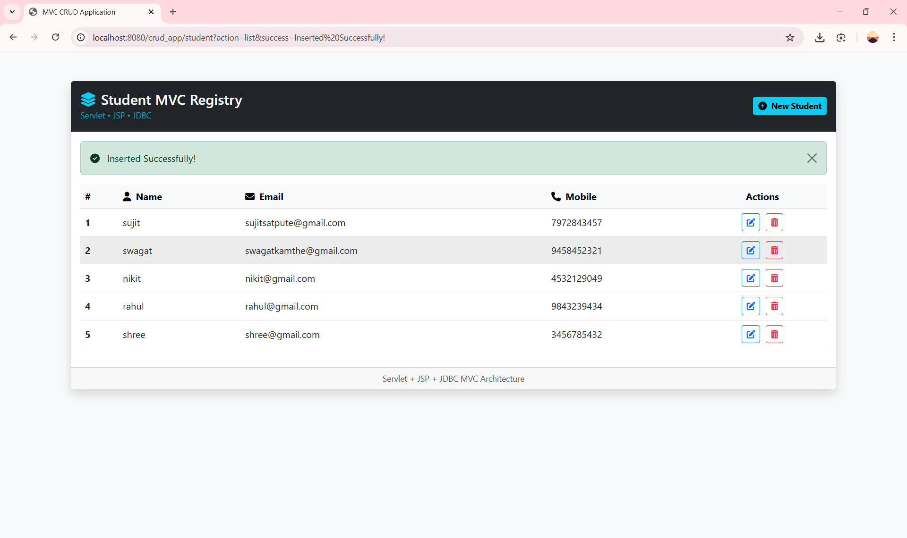           |
| Edit Student            | 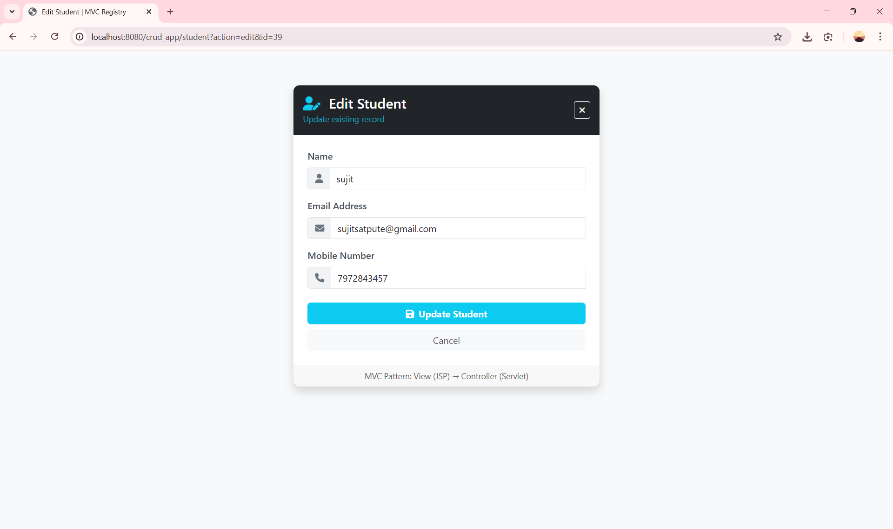                        |
| Validation – Name       | 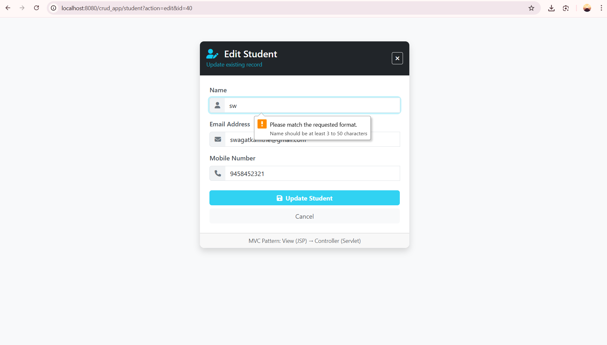       |
| Validation – Mobile     | 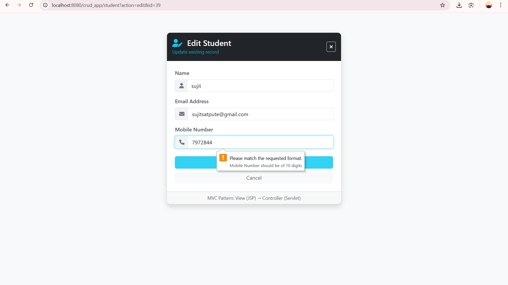 |
| Error Page              | 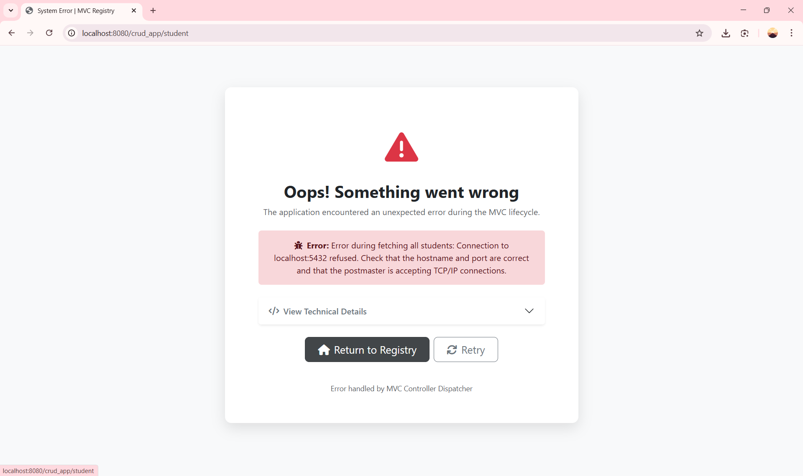                      |

---

### v1.1 – Pagination Enhancements

| Feature               | Screenshot |
|-----------------------|------------|
| Pagination Toolbar    | 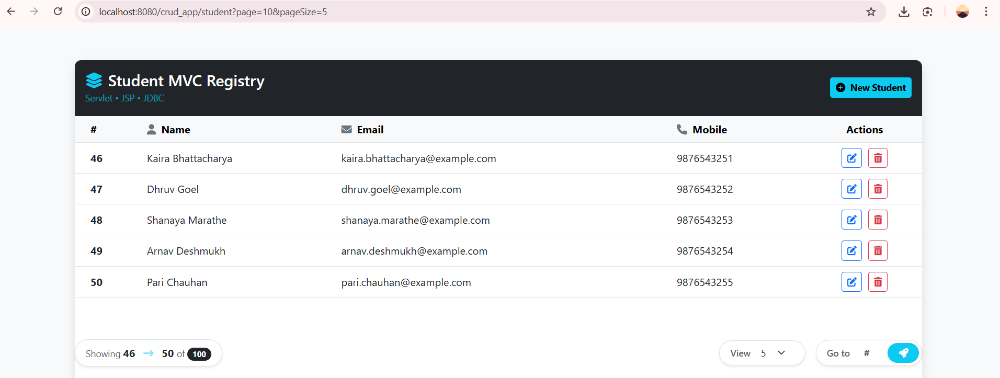 |
| Pagination Navigation | 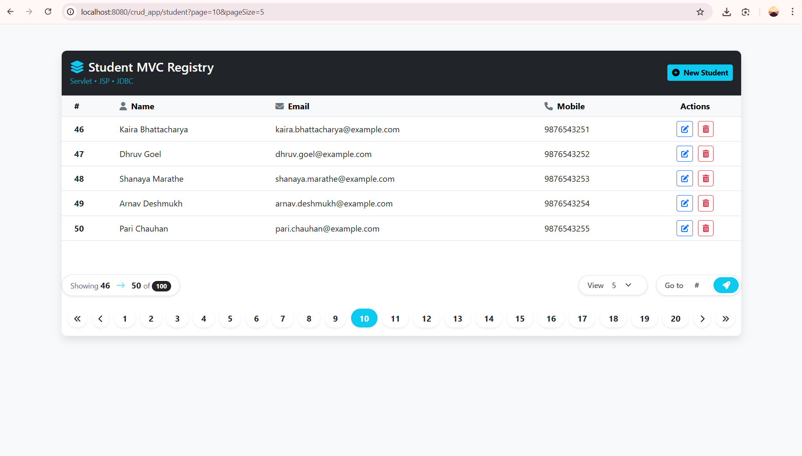 |

---

### v1.2 – Authentication

| Feature                  | Screenshot |
|--------------------------|------------|
| Register Page            | 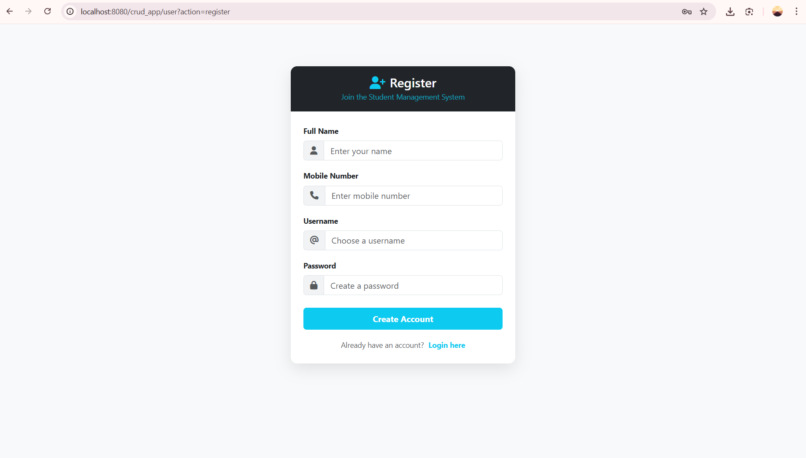 |
| Login Page               | 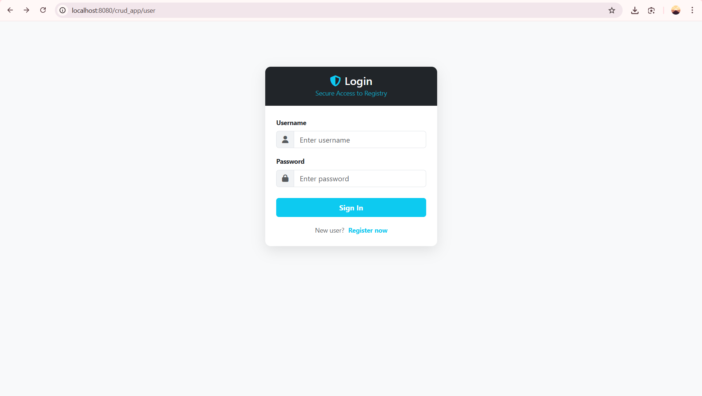 |
| Register Success         | 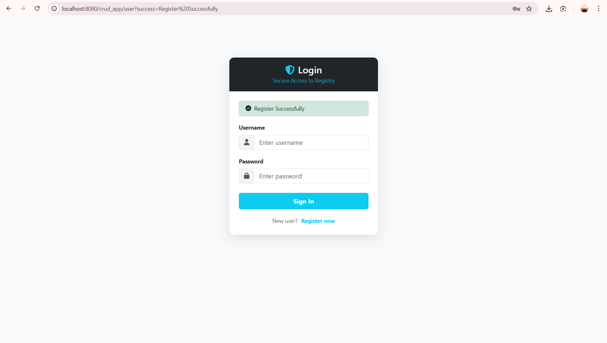 |
| Invalid Register         | 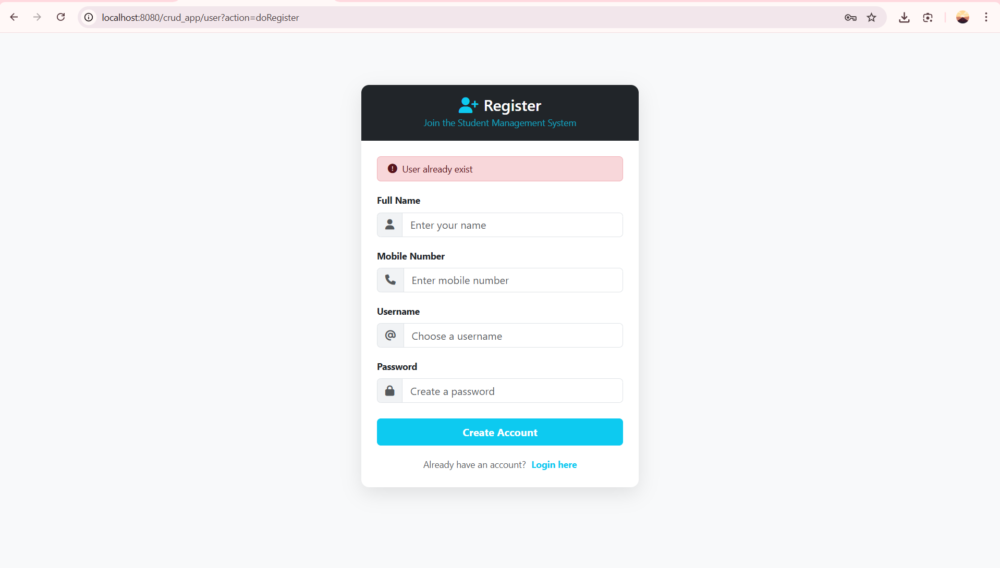 |
| Invalid Login            | 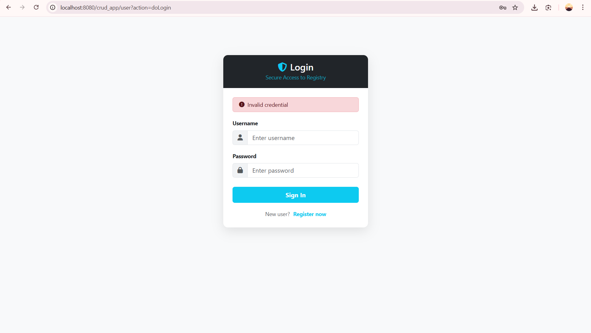 |
| Authentication Protected | 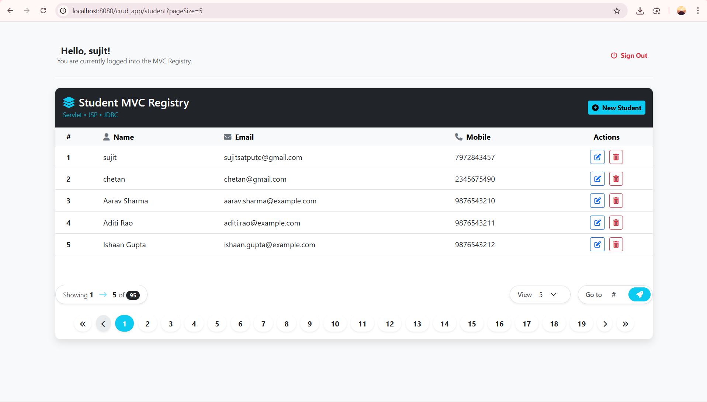 |

---

## 🎯 Purpose of This Project

- Learn MVC fundamentals deeply
- Build CRUD applications the right way
- Understand incremental feature evolution
- Prepare an interview-ready project
- Serve as a teaching and learning reference
- Act as a base for ORM migration (Hibernate / JPA)

---

## 🤝 Contributing

Contributions are welcome for:
- Code improvements
- Refactoring
- Documentation
- Feature suggestions

Please create a feature branch and submit a pull request.

---

## 🧹 Git Hygiene

The repository includes a proper `.gitignore` to exclude:
- IDE configuration files
- Build artifacts
- Temporary files and logs

---

## 📄 License

This project is open-source and intended for **educational purposes**.

---

## 👤 Author

**Sujit Satpute**  
Java Full Stack Developer

---

## 🙏 Acknowledgement

- Java open-source community
- Apache Tomcat & PostgreSQL teams
- Bootstrap & Font Awesome
- Students and developers who inspire continuous learning